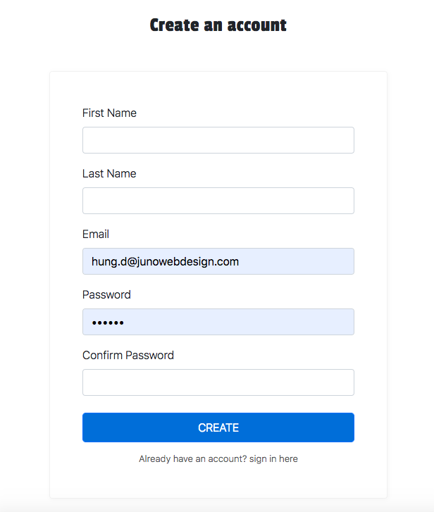

# Bài tập 10
## 1. Form Reactive
### Yêu cầu:
- Tạo 1 form register với các field như hình bên dưới
- Chức năng:
  + Áp dụng reactive form để xử lý và validate data
  + Sau khi lấy data xong dùng service `localer` vừa rồi để lưu vào local và lưu ý khi lưu vào nên kiểm tra email đã tồn tại hay chưa nếu có thì báo message là email đã tồn tại còn ko thì vẩn lưu vào thêm vào, và lưu theo kiểu array object [{firstname: ''},{firstName:''}]
  + Cái message báo email đã tồn tại sẽ nằm phía trên của form, dùng message style của bootstrap `https://getbootstrap.com/docs/4.3/components/alerts/`
  + Validate theo như yêu cầu sau:
    1. firstName: required,
    2. lastName: required
    3. email: email validate (abc@...)
    4. password: required
    4. confirm password: required

### Hình ảnh:

