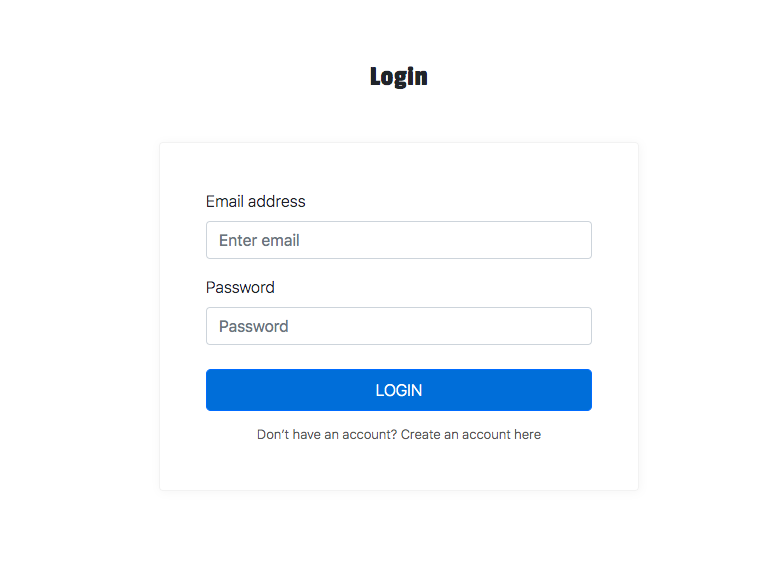

# Bài tập 11
## 1. Template-driven form
### Yêu cầu:
- Tạo 1 form login như hình bên dưới và dùng Template-driven form
- Chức năng: 
  + Lấy data ở form login, xong rồi lấy data ở form register đã đăng ký dưới local và check như sau:
    * Nếu đúng với (email && password) ở local thì có thông báo message ở trên form là `Login successfully!`
    * Nếu sai thì thông báo `Account doesn't exist. Enter a different account.`
- Lưu ý có style nhé và dùng form của bootstrap.
 
### Hình ảnh:

