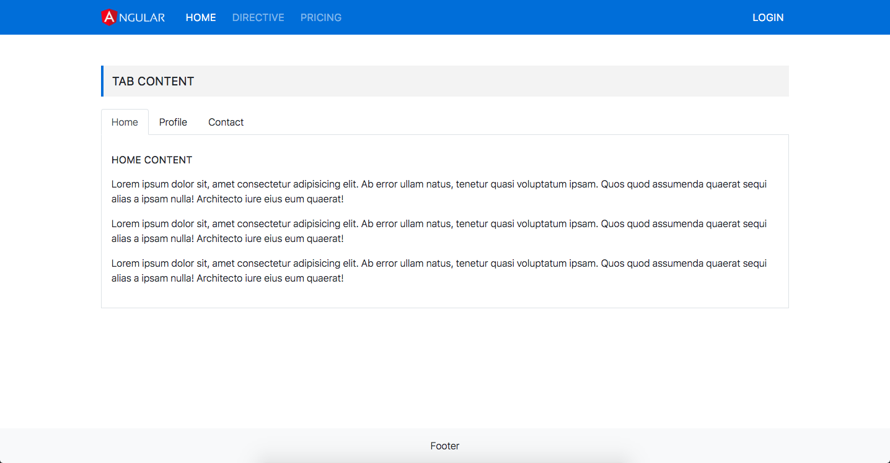

# Bài tập 4
### Yêu cầu:
- Làm giao diện như hình bên dưới
- Làm chức năng trao đổi thông tin giữa 2 component, chia ra như sau:
    - Phần tab click (home, profile, contact) là nằm ở component cha và khi click sẽ gửi thông tin đến cho component con biết để hiện content cho phù hợp.
    - Phần content sẽ nằm ở component con, component con sẽ nhận thông tin từ cha và có thể dùng `*ngIf` để show content cho phù hợp.
    - Component cha sẽ là `app-root` , component con là `app-child`
- Dùng tab của bootstrap `https://getbootstrap.com/docs/4.0/components/navs/#tabs`
- Chưa rở yêu cầu thì hỏi mình trên `channel` nhoé.

### Hình ảnh:

