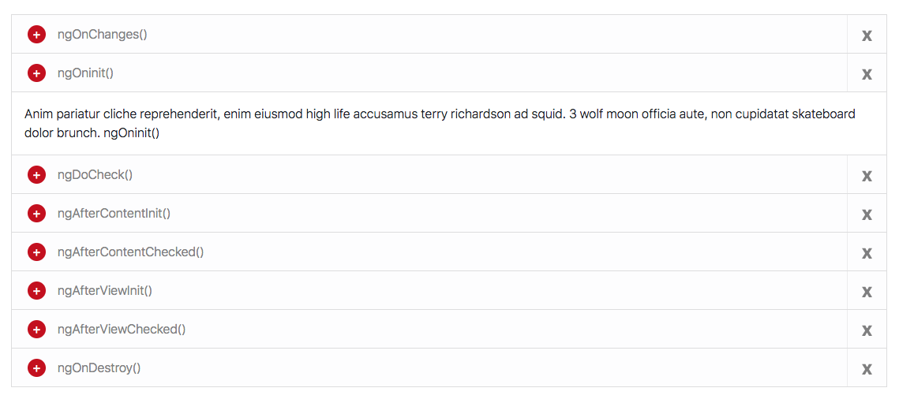
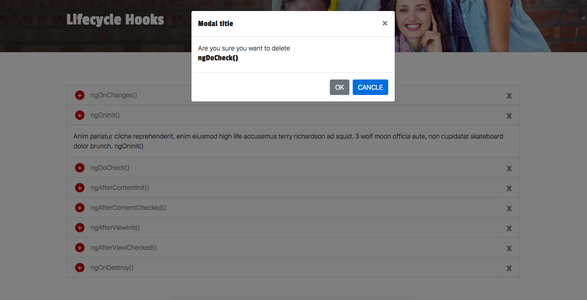

# Bài tập 4
### Yêu cầu:
- Làm giao diện như hình bên dưới
- Chức năng:
    - Show list lifecycle hooks
    - Click vào button dấu cộng màu đỏ sẽ open ra cái content của từng cái lifecycle
    - Dấu chéo bên phải là remove 1 cái lifecycle, khi click vào sẽ hiện lên modal confirm như hình bên dưới, bấm nút OK thì xoá lifecycle đó, Cancle vs nút `x` thì tắt modal
    - Trên modal content sẽ thay đổi theo từng cái lifecycle muốn xoá
- Tạo component:
    - Dùng component `app-root` là component cha
    - Tạo thêm 1 component là `app-lifecycle-title` và 1 component là `app-lifecycle-content`
    - Tạo 1 component riêng cho modal `app-modal`
- Dùng collapse và modal của bootstrap

### Hình ảnh:

