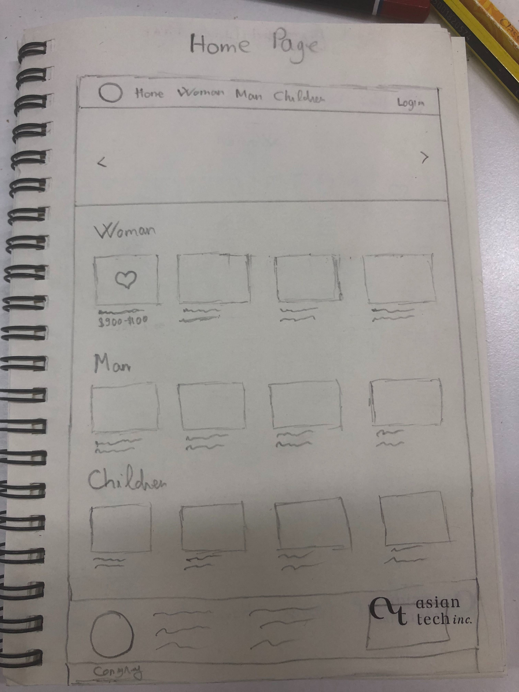
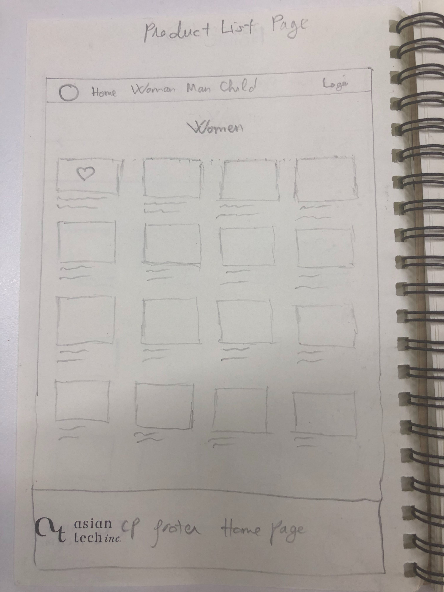
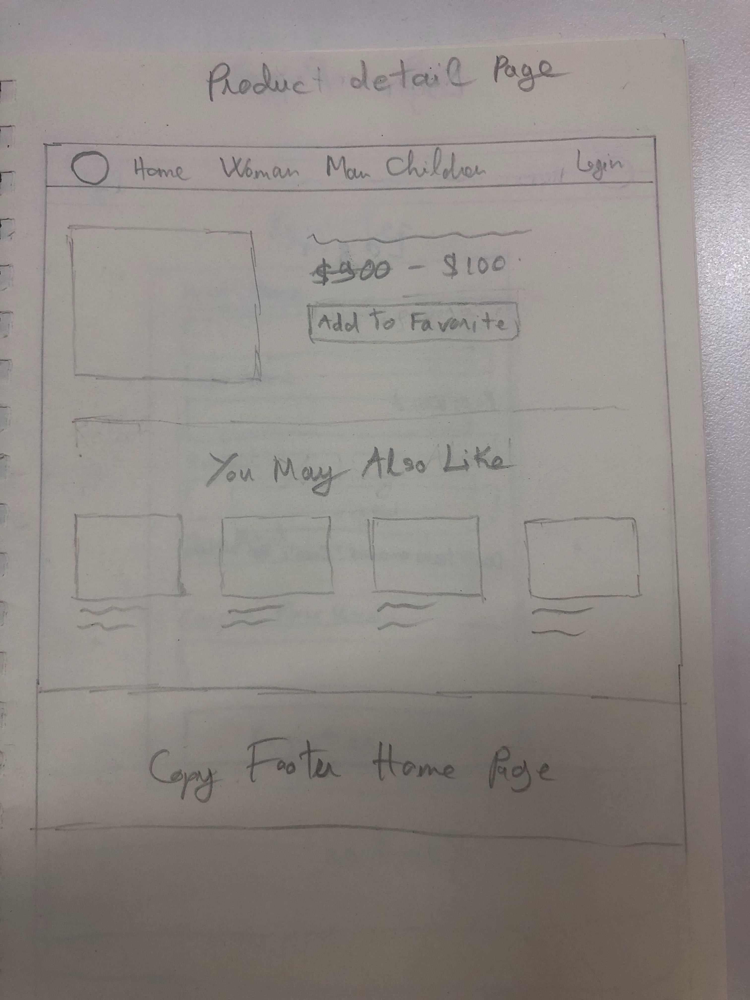
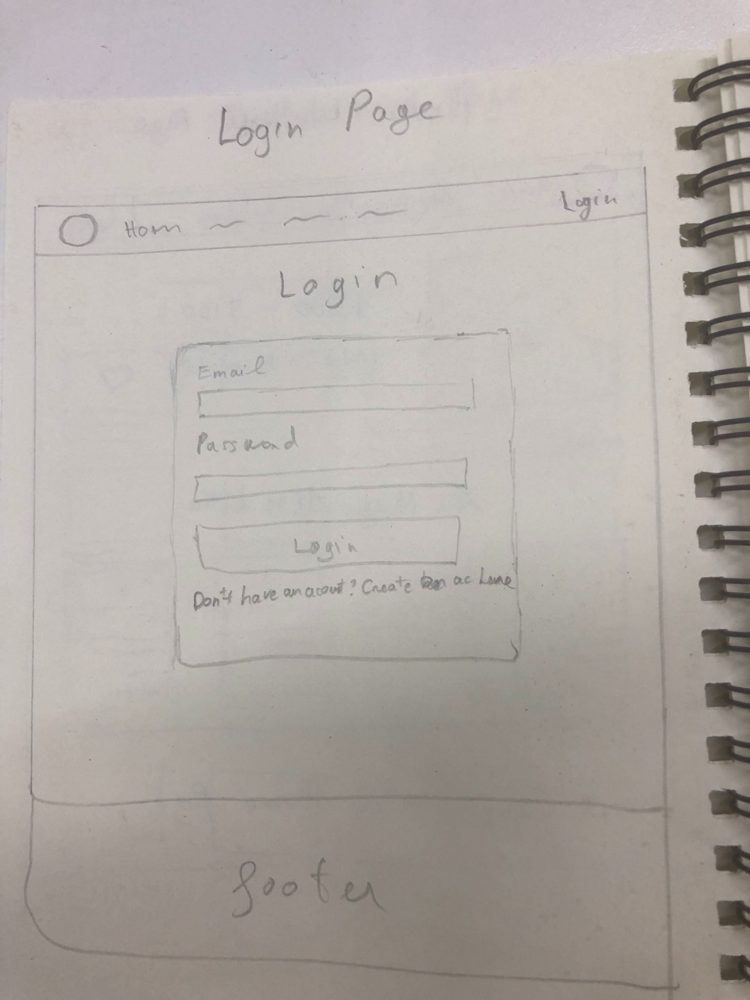
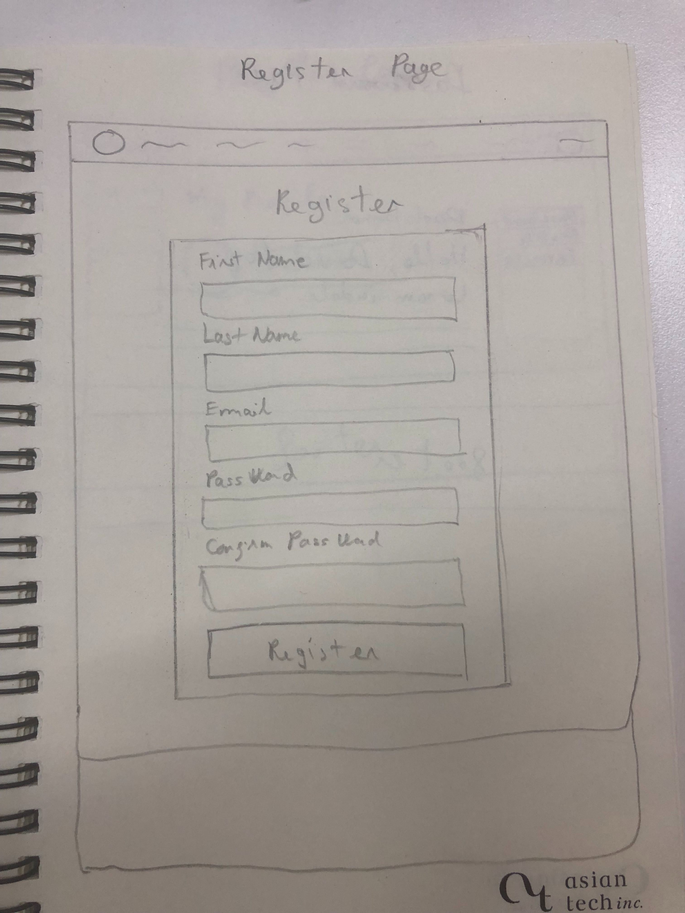
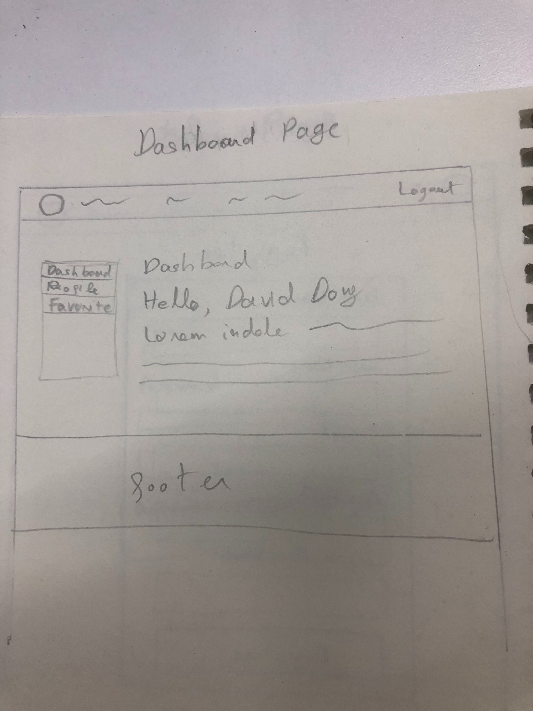
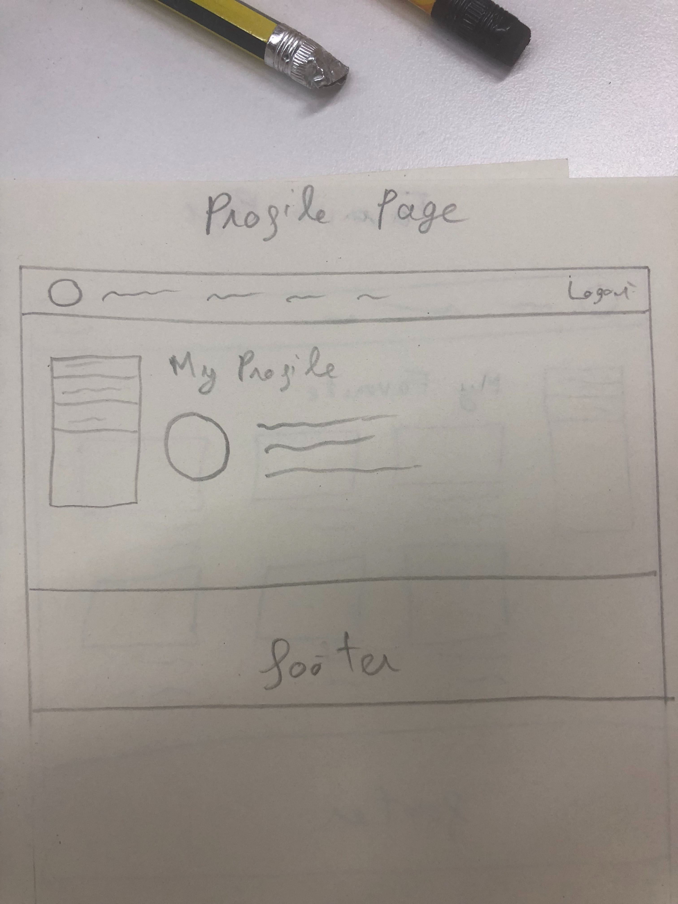
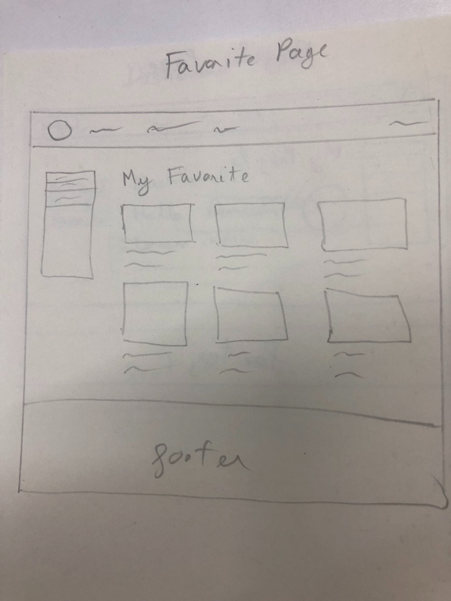

# Bài tập cuối khoá
## Yêu cầu:
- Làm 1 page bán hàng đơn giản và không có order chỉ có chức năng chọn sản phẩm yêu thích.
- Sẽ có những màn hình sau đây và chức năng cho từng màn hình:
  + Home
    * Chức năng:
      1. Hiển thị banner slideshow
      2. Hiển thị 4 sản phẩm cho từng category
      3. Khi hover vào sản phẩm sẽ có hiện lên nút favorite, click vào đó sẽ lưu sản phẩm lại và sẽ hiện trong trang My Favorite
      4. Chỉ login vào mới thấy nút favorite trên sản phẩm
  + Product list
    * Chức năng:
      1. Hiển thị danh sách sản phâm theo category
      2. Chức năng favorite như home page
  + Product detail
    * Chức năng:
      1. Hiển thị chi tiết của sản phẩm gồm ảnh, tên, giá và nút favorite
      2. Hiển thị những sản phẩm liên quan
  + Login 
    * Chức năng:
      1. Login xong sẽ chuyển vào trang dashboard
      2. Nếu chưa có tài khoản sẽ click vào link bên dưới ( Don't have an account? Create an account here ) sẽ move đên trang register
  + Register
    * Chức năng:
      1. Đăng ký account xong sẽ chuyển vào trang dashboard
      2. Có validate các field
  + My Dashboard
    * Chức năng
      1. Show menu bên trái và có active cho từng page
        - My dashboard
        - My Profile
        - My Favorite
      2. Show title page
      3. Show hello, ....
      4. Show đoạn chữ latin bên dưới chữ hello
  + My Profile
    * Chức năng:
      1. Show thông tin của user
      2. Có thể update thêm thông tin cho user
  + My Favorite
    * Chức năng:
      1. Show những sản phẩm yêu thích
      2. Có thể xoá sản phẩm yêu thích

## Hình ảnh mockup
### Home page

### Product list

### Product detail

### Login

### Register

### Dashboard

### Profile

### Favorite

