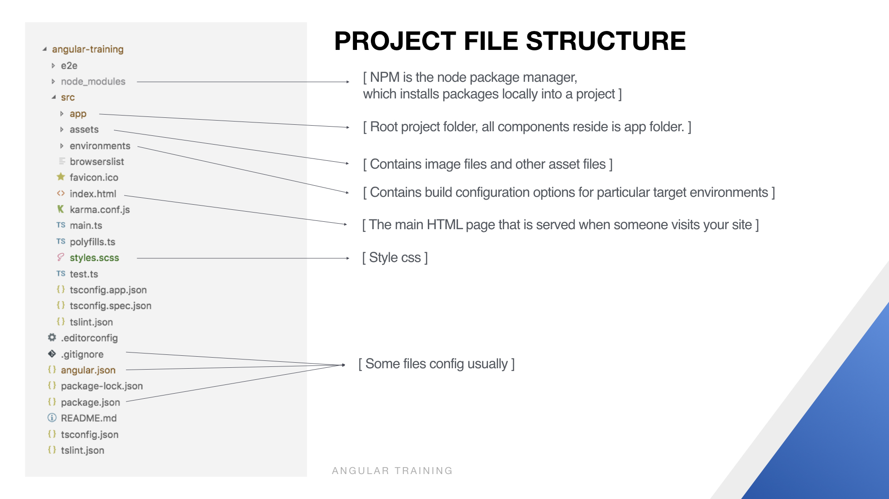
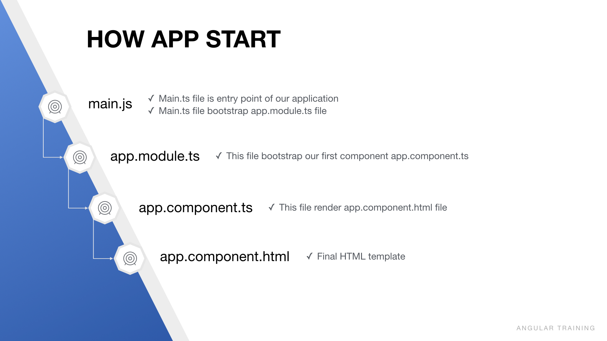
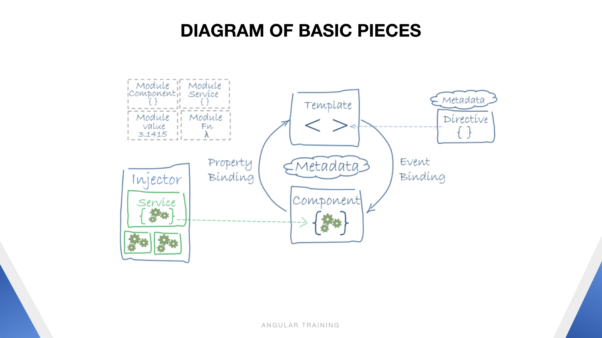
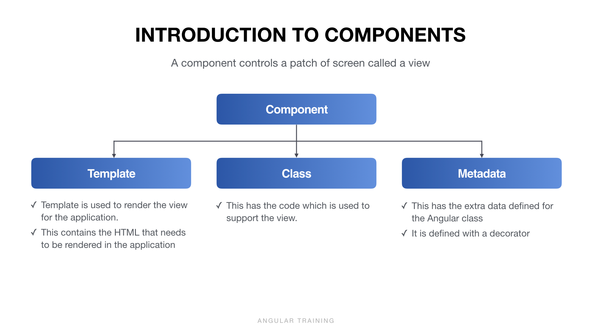
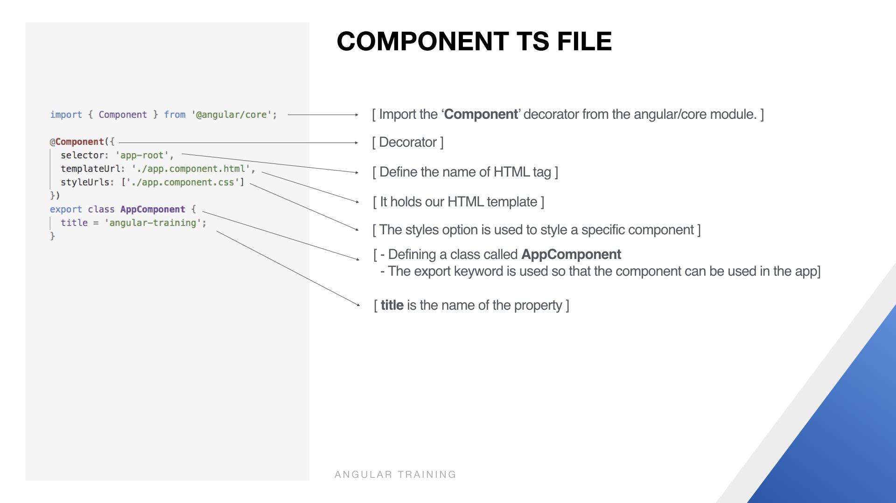
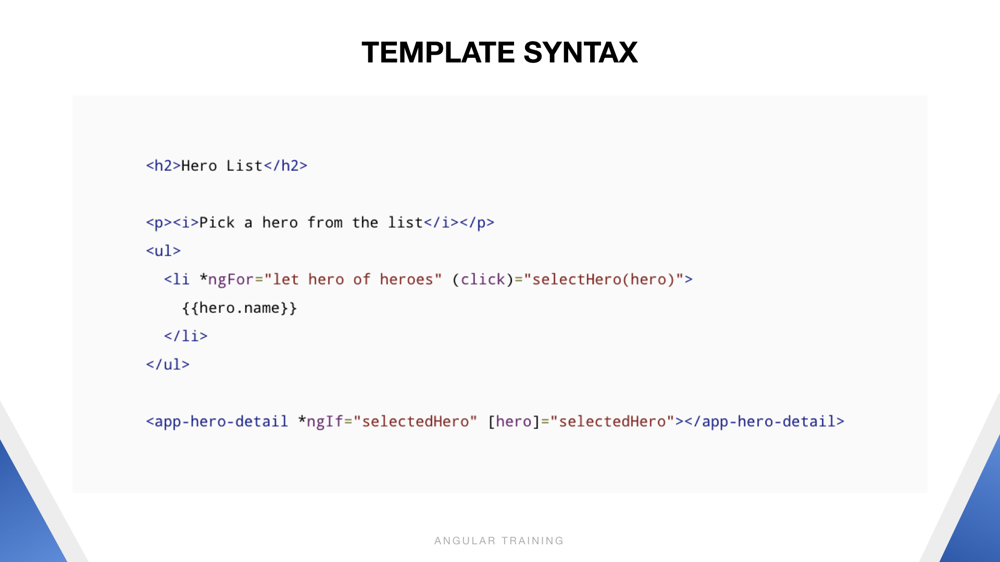
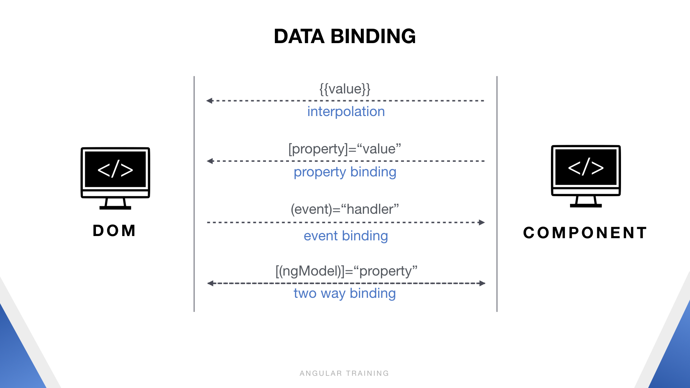

## INTRODUCTION
- Angular is an open source JavaScript framework that is used to build single page based web applications
- Developed by Google
- Release Date - March 2017
- One framework. Mobile & Desktop.

## FEATURES & BENEFITS
1. **Cross Platform**
    - Native
    - Desktop
    - Progressive web apps
2. **Speed and Performance**
    - Code Generation
    - Universal
    - Code Splitting
3. **Productivity**
    - Templates
    - Angular CLI
    - IDEs
4. **Full Development Story**
    - Testing
    - Animation
    - Accessibility

## Angular Cli
  - Install @angular/cli 
  - Read document in `https://cli.angular.io/`

## App structure
  

## How app start
  

## DIAGRAM of basic pieces
  

## Introduction to components
  

## Component ts file
  

## Template syntax
  

## Data binding
  

# Concepts
1. Client side rendering & Server side rendering
2. Framework & Library
