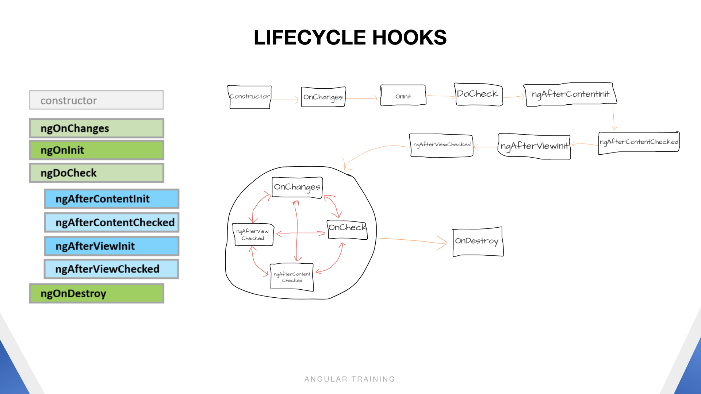

# Lifecycle Hooks

# Some note when using the lifecycle hooks
1. `ngOnChanges` only working in the component has an @input or @output and run multiple time.
2. Use `ngAfterviewInit` when have is used the `ng-content` and it run only 1 time
3. ...
