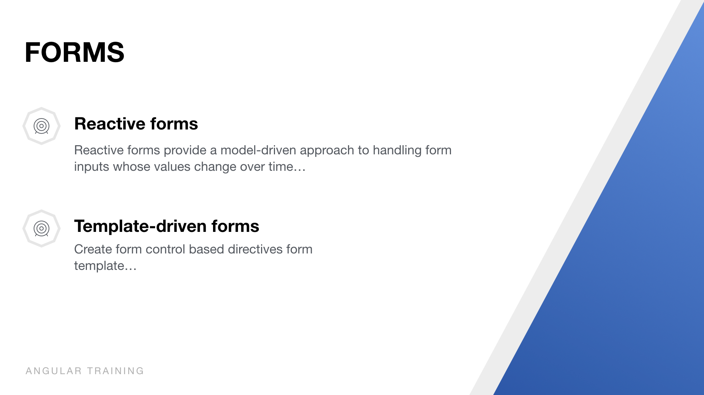
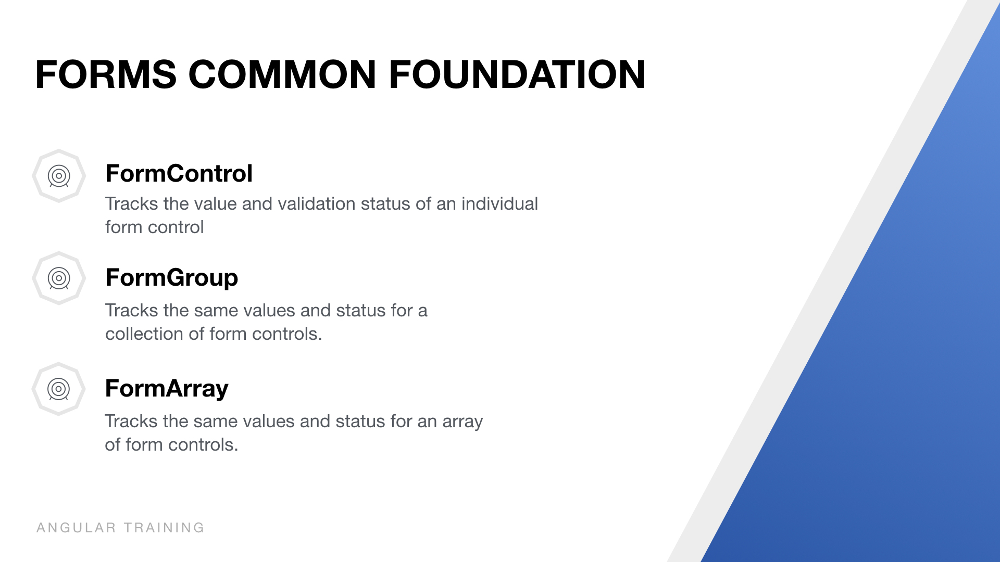
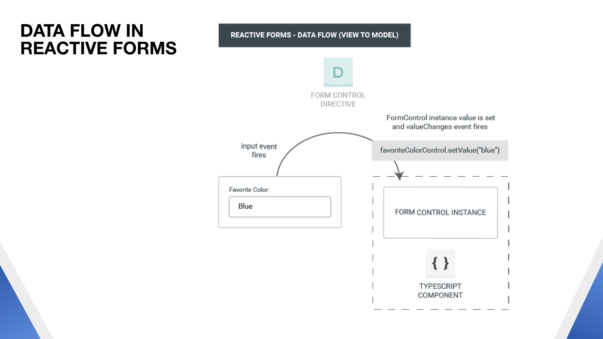
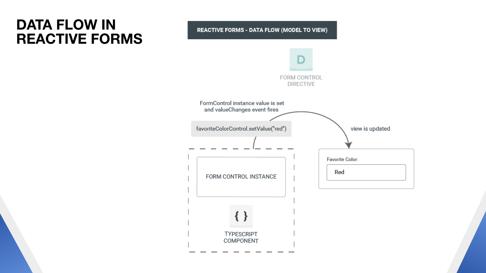
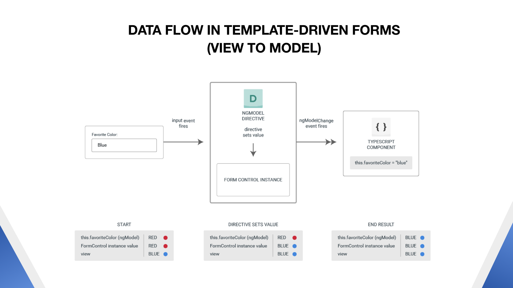

# FORMS






## Triển khai với Reactive Form
### 1. Các yêu cầu khi làm vơi Reactive Form
  - Import `ReactiveFormsModule` vào module quản lý của component cần dùng, hiện tại module quản lý của chúng ta đó là `app-module`.
  - Import những feature của module bên trong component như bên dưới: 
    ```
    // Lưu ý cái nào cần dùng để handle thì mình import vào.
    import { FormGroup, FormBuilder, Validators, FormArray, FormControl } from '@angular/forms';
    ```
### 2. Khai báo form build trong component.ts theo ví dụ dưới.
  ```
  formReactive: FormGroup;

  constructor(
    private fb: FormBuilder
  ) { }

  ngOnInit() {
    this.formReactive = this.fb.group({
      firstName: ['', Validators.required],
      lastName: ['', Validators.maxLength(10)],
      email: [''],
      address: this.fb.group({
        street: ['', Validators.maxLength(10)],
        district: [''],
        city: ['']
      }),
      password: [''],
      confirmPassword: [''],
      moreInfo: this.fb.array([
        this.fb.control(''),
        this.fb.control('')
      ])
    });
  }
  ```

  * Chi tiết về ví dụ trên:
    - FormBuilder: là servive của reactive form.
    - `this.fb.group`: để group những form control liên quan
    - Từng file con trong form group gọi là FormControl

  * Một vài tính năng khác khi làm việc với reactive form
      1. Dùng event value change để bắt sự thay đổi của form field và get value.
          ```
          // Dành cho cả form
            this.formReactive.valueChanges.subscribe(data => console.log(data));

          // Dành cho form control
            this.formReactive.controls.firstName.valueChanges.subscribe(data => console.log(data));
          ```
      2. Set value cho form có 2 cách:
          ```
            \\ 1. Dùng hàm setValue()
            this.formReactive.setValue({
              firstName: 'abc',
              lastName: 'bcd'
            });

            \\ 2. Dùng hàm patchValue()
            this.formReactive.patchValue({
              firstName: 'abc',
              lastName: 'bcd'
            });
          ```
          * Lưu ý sự khác biệt giữa 2 thằng này:
            - setValue(): khi dùng hàm này thì phải set value hết cho tất cả các field, nếu ko sẽ có lổi xảy ra.
            - patchValue(): thì ngược lại với setValue()

      3. Form validate
          - Dùng form validate bằng cách import `Validators`
          ```
            // 1 cái
            firstName: ['', Validators.required],

            // Nhiều cái
            firstName: ['', [Validators.required, Validators.maxLength(20)]],
          ```

      4. Add more field với form Array
          ```
            ...
            // set default 2 form control
            password: [''],
            confirmPassword: [''],
            moreInfo: this.fb.array([
              this.fb.control(''),
              this.fb.control('')
            ])

            // Push new form control
            addMoreInfo() {
              this.moreInfo.push(this.fb.control(''));
            }

            // Get form array to push more form control
            get moreInfo() {
              return this.formReactive.get('moreInfo') as FormArray;
            }
          ```

### 3. Khai báo form với component template
```
<form action="" [formGroup]="formReactive" (ngSubmit)="onSubmit()">
    <div class="form-group">
      <label>First Name</label>
      <input type="text" class="form-control" formControlName="firstName">
      <div *ngIf="formReactive.controls.firstName.invalid 
        && (formReactive.controls.firstName.dirty || formReactive.controls.firstName.touched)">
        <span *ngIf="formReactive.get('firstName').errors.required">This field is required</span>
      </div>
    </div>
    <div class="form-group">
      <label>Last Name</label>
      <input type="text" class="form-control" formControlName="lastName">
    </div>
    <div class="form-group">
      <label>Email</label>
      <input type="email" class="form-control" formControlName="email">
    </div>
    <div class="form-group" formGroupName="address">
      <label>Address</label>
      <div class="row">
        <div class="col-md-4">
          <input type="text" class="form-control" formControlName="street" placeholder="Street">
        </div>
        <div class="col-md-4">
          <input type="text" class="form-control" formControlName="district" placeholder="district">
        </div>
        <div class="col-md-4">
          <input type="text" class="form-control" formControlName="city" placeholder="city">
        </div>
      </div>
    </div>
    <div class="form-group">
      <label>Password</label>
      <input type="password" class="form-control" formControlName="password">
    </div>
    <div class="form-group">
      <label>Confirm Password</label>
      <input type="password" class="form-control" formControlName="confirmPassword">
    </div>
    <div formArrayName="moreInfo">
      <label class="mb-4">More Info</label> <button type="button" (click)="addMoreInfo()" class="ml-3 btn btn-primary btn-sm">Add Alias +</button>
      <div class="row">
        <div class="col-md-3 mb-2" *ngFor="let more of moreInfo.controls; let i=index">
          <input class="form-control" type="text" [formControlName]="i">
        </div>
      </div>
    </div>
    <button type="submit" class="btn btn-primary" [disabled]="formReactive.invalid">Submit</button>
  </form>
  ```
  * Chi tiết về ví dụ trên:
    - (ngSubmit): dùng để bắt event submit form
    - [formGroup]: khai báo reactive form
    - formControlName: khai báo form control
    - formGroupName: khai báo form group
    - formArrayName: khai báo form group
    - validators: có các kiểu sau 
      + touched: true nếu người dùng đã focus vào input rồi không focus vào nữa.
      + untouched: true nếu người dùng chưa đụng chạm gì hoặc lần đầu tiên focus và chưa bị mất focus (ngược lại với touched)
      + dirty: true nếu người dùng đã tương tác với control – nhập một ký tự vào input text chẳng hạn.
      + pristine: true nếu người dùng chưa tương tác gì với control, mặc dù có thể đã touched, nhưng chưa sửa đổi gì.

> Trên đây là những cái mà chúng ta sẽ thường gặp. mọi người muốn tìm hiểu thêm thì lên trang docs của angular nhé.
